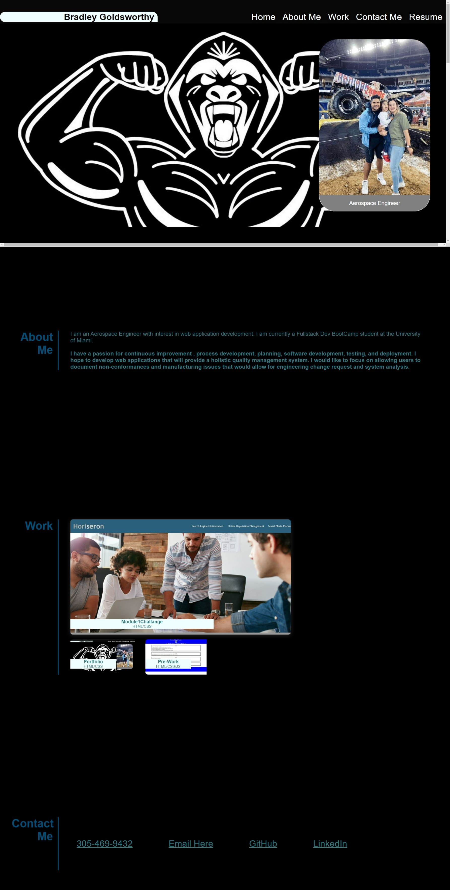

# My Portfolio

## Overview

Portfolio starter website for UM Bootcamp Week 2 


## File Structure

##### root

```shell
   |-- assets
```
`root/`

- Contains HTML;


`assets/`

- Contains CSS, Images;


## Remote Site

The remote site is used for display and hosted on GitHub Pages

##### The remote site is located here:
*Home Page*<br>[https://bulkacity.github.io/MyPortfolio/](https://bulkacity.github.io/MyPortfolio/)

### Screenshot

